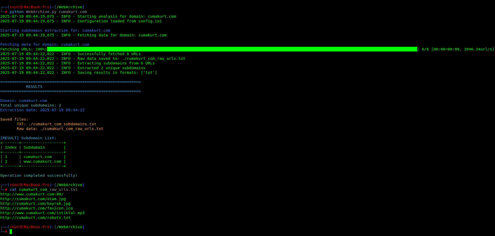

# WebArchive Subdomain Extractor



[Python 3.7+](https://www.python.org/downloads/)
[License: GPL](LICENSE)
[Status: Active]

## Usage Example

```bash
python web.archive.py <domain>
```

## Features

- Advanced Extraction: Extract subdomains from Wayback Machine CDX API
- Multiple Formats: Export results in TXT, JSON, and CSV formats
- Smart Filtering: Filter subdomains using regex patterns, length constraints, and keyword exclusion
- Progress Tracking: Visual progress bars and real-time status updates
- Comprehensive Logging: Detailed logging with configurable levels
- Retry Mechanism: Automatic retry for failed requests
- Input Validation: Domain format validation and sanitization
- Statistics: Detailed statistics and reporting
- Configuration: Flexible configuration via INI files

## Table of Contents

- [Installation](#installation)
- [Quick Start](#quick-start)
- [Usage Examples](#usage-examples)
- [Configuration](#configuration)
- [Output Formats](#output-formats)
- [Filtering Options](#filtering-options)
- [Advanced Features](#advanced-features)
- [Troubleshooting](#troubleshooting)
- [FAQ](#faq)
- [License](#license)

## Installation

### Prerequisites

- Python 3.7 or higher
- pip package manager

### Install Dependencies

```bash
# Clone the repository
git clone https://github.com/yourusername/webarchive-subdomain-extractor.git
cd webarchive-subdomain-extractor

# Install required packages
pip install -r requirements.txt
```

### Requirements

Create a `requirements.txt` file with the following dependencies (see note below for version pinning):

```txt
requests==2.31.0
prettytable==3.9.0
termcolor==2.4.0
tqdm==4.66.1
```

## Quick Start

### Basic Usage

```bash
python web.archive.py <domain>
```

### Advanced Usage

```bash
python web.archive.py <domain> --format txt json csv --output-dir results
python web.archive.py <domain> --filter "test|dev" --exclude-words admin,test
python web.archive.py <domain> --verbose
```

## Usage Examples

### 1. Basic Subdomain Extraction

```bash
python web.archive.py <domain>
```

### 2. Multiple Output Formats

```bash
python web.archive.py <domain> --format txt json csv --output-dir results
```

### 3. Advanced Filtering

```bash
python web.archive.py <domain> --filter "test|dev"
python web.archive.py <domain> --exclude-words admin,test,staging
python web.archive.py <domain> --min-length 10 --max-length 30
python web.archive.py <domain> --filter "api|service" --exclude-words admin --min-length 8
```

### 4. Verbose Output with Statistics

```bash
python web.archive.py <domain> --verbose
```

### 5. Custom Configuration

```bash
python web.archive.py <domain> --config custom_config.ini
python web.archive.py <domain> --log-level DEBUG
```

## Configuration

### Configuration File (`config.ini`)

```ini
[DEFAULT]
# API Settings
api_url = https://web.archive.org/cdx/search/cdx
output_format = txt
collapse = urlkey
max_results = 10000
timeout = 30
max_retries = 3
retry_delay = 1

# User Agent
user_agent = WebArchive-Subdomain-Extractor/1.0

# Default Filters
default_exclude_words = admin,test,dev,staging
default_min_length = 5
default_max_length = 50
```

### Command Line Options

| Option | Description | Example |
|--------|-------------|---------|
| `domain` | Target domain to analyze | `example.com` |
| `--output-dir, -o` | Output directory | `--output-dir results` |
| `--format, -f` | Output formats | `--format txt json csv` |
| `--filter` | Regex filter pattern | `--filter "test\|dev"` |
| `--exclude-words` | Words to exclude | `--exclude-words admin,test` |
| `--min-length` | Minimum length | `--min-length 10` |
| `--max-length` | Maximum length | `--max-length 30` |
| `--max-results` | Max results to fetch | `--max-results 5000` |
| `--verbose, -v` | Verbose output | `--verbose` |
| `--config, -c` | Config file | `--config custom.ini` |
| `--log-level` | Logging level | `--log-level DEBUG` |

**Note:** Output files are saved in the specified output directory. You can customize the output directory with `--output-dir`. Log files are saved in the `logs/` directory by default. If the application cannot write to the log directory, it will fall back to console logging.

**Dependency Version Pinning:** For maximum reproducibility, use the exact versions listed in `requirements.txt`.

## Output Formats

### 1. TXT Format
Plain text file with one subdomain per line.

### 2. JSON Format
Structured JSON with metadata.

### 3. CSV Format
CSV file with index and subdomain columns.

## Filtering Options

### Regex Filtering
```bash
python web.archive.py <domain> --filter "test|dev|staging"
python web.archive.py <domain> --filter "api|service|backend"
```

### Keyword Exclusion
```bash
python web.archive.py <domain> --exclude-words admin,test,dev
python web.archive.py <domain> --exclude-words staging,beta,old
```

### Length Filtering
```bash
python web.archive.py <domain> --min-length 8
python web.archive.py <domain> --max-length 25
python web.archive.py <domain> --min-length 8 --max-length 25
```

## Advanced Features

- Progress tracking with tqdm
- Retry mechanism for failed requests
- Comprehensive logging
- Domain validation

## Troubleshooting

- **Connection Timeout:** Increase `timeout` in config.ini or use a lower `--max-results` value.
- **No Results Found:** Try without filters or check if the domain exists in the Wayback Machine.
- **Permission Errors:** Ensure write permissions to the output and logs directories.
- **Memory Issues:** Use `--max-results` to limit results for large domains.


## FAQ

**Q: Can I delete the `__pycache__` or `logs` folders?**  
A: Yes, they are automatically recreated as needed.

**Q: How do I change the output file names?**  
A: Use the `--output-dir` option to change the directory. File names are based on the domain.

**Q: What if I get a permission error?**  
A: Make sure you have write permissions to the output and logs directories.

**Q: How do I pin dependency versions?**  
A: Use the exact versions in `requirements.txt`.

## License

This project is licensed under the GNU General Public License (GPL) 

## Acknowledgments

- Wayback Machine (https://web.archive.org/) for providing the CDX API
- Internet Archive (https://archive.org/) for preserving web history
- Open source community for the excellent Python libraries used

## Developer

Developed by Cuma KURT  
Email: cumakurt [at] gmail [dot] com  
[LinkedIn](https://www.linkedin.com/in/cuma-kurt-34414917/) 
